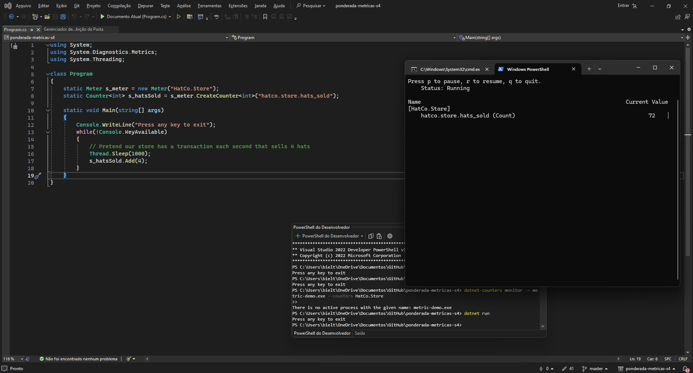
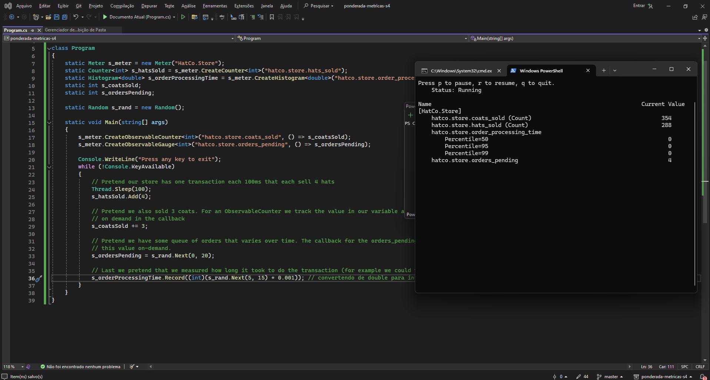
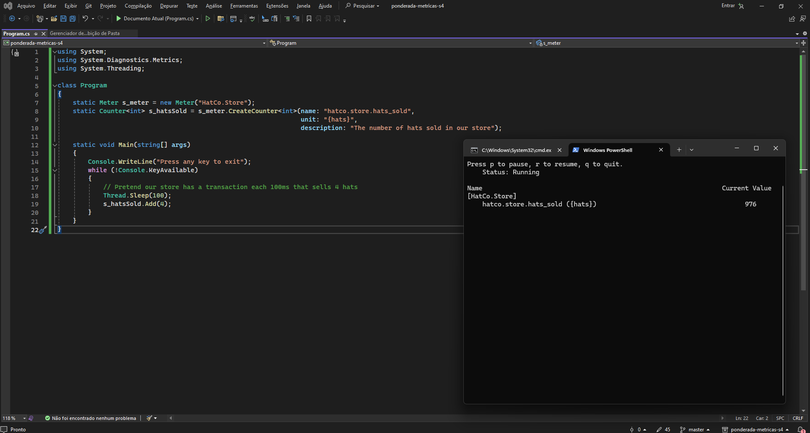
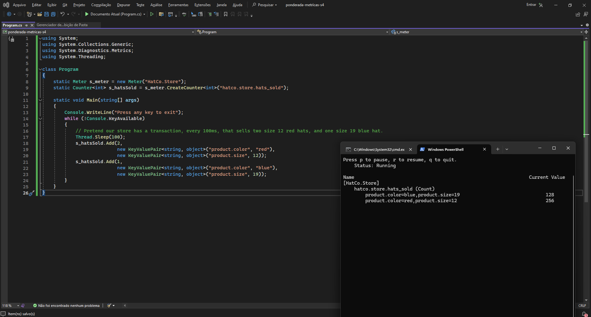
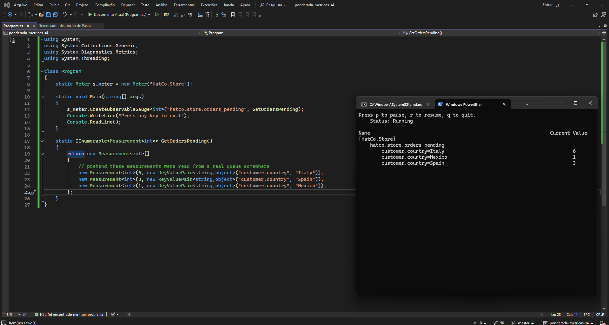

# Relatório: Tutorial para criar uma métrica personalizada

## Resumo
Este relatório destaca os passos seguidos para criar uma métrica personalizada!

## Prints

## Passo 1: Configuração do ambiente
- Instalar o SDK do .NET Core 6 ou posterior, se ainda não estiver instalado.
- Certifique-se de ter acesso a uma linha de comando (CLI) para executar os comandos do .NET.

## Passo 2: Criação do aplicativo de console
- Utilizar o comando `dotnet new console` para criar um novo aplicativo de console.
- Adicionar a referência ao pacote NuGet `System.Diagnostics.DiagnosticSource` usando o comando `dotnet add package System.Diagnostics.DiagnosticSource`.

## Passo 3: Atualização do código
- Abri o arquivo `Program.cs` e substitui seu conteúdo pelo código fornecido no tutorial.
- O código define uma classe `Program` com um método `Main`, onde são criados e utilizados instrumentos de métricas, como um contador.

## Passo 4: Execução do aplicativo
- Executei o aplicativo usando o comando `dotnet run` na linha de comando.
- O aplicativo irá simular transações de uma loja e registrar medidas usando os instrumentos de métricas criados.

## Passo 5: Visualização das métricas
- Instalei a ferramenta `dotnet-counters` usando o comando `dotnet tool update -g dotnet-counters`.
- Usei o comando `dotnet-counters monitor -n <nome_do_aplicativo>` para monitorar as métricas do aplicativo em execução.

## Passo 6: Práticas recomendadas
- Segui as diretrizes fornecidas no tutorial para o uso adequado de instrumentos de métricas.
- Considerei o uso de injeção de dependência para obter um medidor em aplicativos que usam esse padrão.

## Conclusão
O tutorial fornece uma introdução abrangente à criação e visualização de métricas personalizadas usando o SDK do .NET Core. Seguindo os passos fornecidos, é inegável que é possível integrar facilmente métricas em aplicativos para monitoramento e análise.